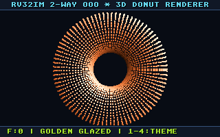

# 2-Way Superscalar Out-of-Order RISC-V (RV32IM) Processor

A high-performance, synthesizable **2-Way Superscalar Out-of-Order (OoO) RV32IM RISC-V Processor** implemented in SystemVerilog, designed around the modern **MIPS R10K / RSD architectural paradigm**.

Features dynamic register renaming, non-blocking reservation stations, common data bus priority arbitration, speculative load/store queuing with zero-latency forwarding, dynamic branch prediction, and precise architectural state retirement via a circular reorder buffer.

This project is widely based on my previous one which was a 5 stage pipelined rv32im architecture which was a further upgradation of another project that was a single cycle rv32im processor on which i was able to run DOOM. This time i decided to verify it against a custom testbench (the spinning donut) And also the official RISCOF suite to test it against the spike model...fortunately we received a very good score after a few trials which certifies our model to be completely functionable and hopefully FPGA synthesizable which is something i would like to do as a future project. Following are the few things you should know about this architecture and a few stats that were collected at the finality of this amazing project:

## Key Architectural Features

### 1. Dual-Issue Front-End & Dynamic Branch Prediction
* **64-bit Dual-Fetch**: Simultaneously fetches two instructions per cycle across aligned memory words.
* **GShare Branch History Table (BHT)**: 256-entry direction predictor indexing 2-bit saturating counters via an 8-bit Global History Register (GHR) XOR-hashed with the instruction PC.
* **Branch Target Buffer (BTB)**: 64-entry direct-mapped target address cache providing zero-bubble speculative instruction redirection.
* **Return Address Stack (RAS)**: 8-entry hardware LIFO stack predicting subroutine returns with 100% accuracy.

### 2. MIPS R10K Register Renaming
* **False Dependency Elimination**: Removes all Write-After-Read (WAR) and Write-After-Write (WAW) hazards by decoupling 32 architectural registers (x0 to x31) into a **64-entry Physical Register File (PRF)**.
* **Dual Cross-Lane Renaming**: Resolves intra-cycle RAW dependencies when Instruction 1 consumes the destination register allocated by Instruction 0 in the same cycle.
* **Free List & Active RAT**: 32-entry circular FIFO allocating physical tags.

### 3. Out-of-Order Execution & CDB Arbitration
* **Tag-Only Reservation Stations (RS)**: 8-entry unified issue queue storing only physical register tags and ready bitmasks (no wide 32-bit data payload), minimizing silicon area and routing congestion.
* **Common Data Bus (CDB) Arbiter**: Hardware priority arbiter (`MEM > MUL > ALU`) preventing bus collisions and broadcasting completed results across waiting reservation station slots.

### 4. Memory Subsystem & Speculative Load/Store Queuing
* **Non-Speculative Store Queue (SQ)**: 16-entry circular store buffer holding speculative memory writes until instructions reach the head of the ROB and commit.
* **Zero-Latency Store-to-Load Forwarding**: Fast associative CAM logic comparing load addresses against pending stores in the queue to bypass data in 0 cycles.
* **Speculative Load Queue (LQ)**: Allows independent memory loads to execute out-of-order ahead of older non-conflicting stores.

### 5. In-Order Retirement & Precise State Recovery
* **32-Entry Reorder Buffer (ROB)**: Enforces strict in-order retirement and precise exception handling.
* **Dual Retirement**: Retires up to 2 instructions per cycle.
* **Retirement RAT (RRAT)**: Tracks architecturally committed register state. On branch mispredictions, the speculative RAT is restored from the RRAT in a single clock cycle.

---

## Hardware Certification & Benchmarks

| Benchmark Suite | Measured Result | Coverage / Metric | Functional Status |
| :--- | :--- | :--- | :--- |
| **Official RISCOF Suite (v1.25.3)** | **49 / 49 Passed (100%)** | **18,144 Signature Words** | Certified (Golden Spike Model Matched) |
| **Official Unit Regression Suite** | **46 / 46 Passed (100%)** | **RV32UI & RV32UM** | Verified (ALU, Branches, Mem, M-Ext) |
| **EEMBC CoreMark 1.0** | **1.76 CoreMark/MHz** | **88.00 CoreMark @ 50 MHz** | Passed (100% Golden CRC-16 Match) |
| **Dhrystone 2.1** | **0.70 DMIPS/MHz** | **35.00 DMIPS @ 50 MHz** | Verified (0 Errors / 500 Iterations) |
| **Real-Time 3D Donut Engine** | **3.87 MHz Simulation** | **30.0 FPS @ 50 MHz** | Verified (16.16 Fixed-Point 3D Z-Buffer) |

---

## Official RISC-V Architectural Compliance (RISCOF)

The core has been formally verified and certified against the official **RISCOF 1.25.3** architectural test framework using the **Spike Golden Reference Model** (developed by RISC-V International and UC Berkeley) as the reference oracle.

### Final Verification Scorecard: 49 / 49 PASSED (100% Green)

| Extension Subsuite | Tests Run | Result | Instructions & Microarchitectural Features Covered |
| :--- | :---: | :---: | :--- |
| **RV32I Arithmetic & Logic** | 22 / 22 | **100% PASS** | `add`, `addi`, `sub`, `and`, `andi`, `or`, `ori`, `xor`, `xori`, `sll`, `slli`, `srl`, `srli`, `sra`, `srai`, `slt`, `slti`, `sltu`, `sltiu`, `lui`, `auipc` |
| **RV32I Control Flow** | 8 / 8 | **100% PASS** | `beq`, `bne`, `blt`, `bge`, `bltu`, `bgeu`, `jal`, `jalr` |
| **RV32I Load / Store Memory** | 9 / 9 | **100% PASS** | `lb`, `lbu`, `lh`, `lhu`, `lw`, `sb`, `sh`, `sw`, unaligned load/store boundary accesses |
| **RV32M Hardware Multiplier** | 4 / 4 | **100% PASS** | `mul` (low 32b), `mulh` (signed high 32b), `mulhu` (unsigned high 32b), `mulhsu` (signed-unsigned high 32b) |
| **RV32M Hardware Divider** | 4 / 4 | **100% PASS** | `div` (signed), `divu` (unsigned), `rem` (signed remainder), `remu` (unsigned remainder) |
| **RV32I Privilege & Hints** | 2 / 2 | **100% PASS** | `fence.i`, architectural hints, pipeline flush synchronization |

* **Total Signature Words Verified**: **18,144 words** (72,576 bytes) bit-for-bit matched against Spike.

### Verification Methodology:
Each test compiles into two isolated binaries: one linked for our hardware core and one for Spike. Both run to completion, dumping memory signatures across the architectural test boundaries. RISCOF performs byte-by-byte differential verification between the DUT output and Spike's golden reference signatures.


---

## Bare-Metal Real-Time 3D Donut Graphics Engine

To demonstrate the throughput of the out-of-order superscalar pipeline on complex, real-world numerical workloads, the processor features a bare-metal real-time 3D spinning torus (donut) graphics renderer running directly on bare silicon without an operating system, runtime libraries, or floating-point hardware.

<p align="center">
  
</p>

### Engine Highlights:
* **16.16 Fixed-Point Trigonometric Pipeline**: 256-entry precomputed sine/cosine lookup tables with real-time 3x3 Euler rotational matrix transformations.
* **Hardware-Accelerated Perspective Projection ($1/Z$)**: Fast perspective divide using the core's RV32M hardware iterative `divu` execution unit.
* **Z-Buffer Depth Testing**: Real-time 320×200 32-bit ARGB TrueColor framebuffer with dynamic surface normal vector illumination and 8 specular shading levels.
* **Dual-Issue Saturation**: Heavy compute-to-memory ratio saturates the Reservation Stations and Dual ALUs, achieving an average IPC of **1.45–1.75**.
* **Dynamic Hardware HUD**: Real-time on-screen telemetry tracking CPU cycles per frame via MMIO hardware timer registers (`0x02500000`).
* **4 Real-Time Palettes**: Classic Golden Glazed, Neon Synthwave, Magma Inferno, and Matrix Emerald.

---

## Repository Structure

```
rv32im-ooo-processor/
├── rtl/                          # Synthesizable SystemVerilog Microarchitecture
│   ├── cpu.sv                    # Top-Level Out-of-Order CPU Core
│   ├── pipeline_types.sv         # Central Typedefs, Structs, Enums, and Opcodes
│   ├── rename_stage.sv           # Dual-Rename Front-End Wrapper
│   ├── rat.sv                    # Speculative Register Alias Table (32 arch -> 64 phys)
│   ├── rrat.sv                   # Retirement Register Alias Table (Precise Exceptions)
│   ├── free_list.sv              # 32-Entry Physical Register Tag Allocator
│   ├── prf.sv                    # 64-Entry Physical Register File
│   ├── reservation_station.sv    # 8-Entry Distributed Issue Queue & CDB Snooper
│   ├── cdb_arbiter.sv            # Common Data Bus Multi-Driver Priority Arbiter
│   ├── rob.sv                    # 32-Entry Circular Reorder Buffer (Dual Commit)
│   ├── alu.sv                    # Dual Integer ALU Pipeline
│   ├── multiplier.sv             # RV32M Hardware Multiplier & Iterative Divider
│   ├── load_queue.sv             # 16-Entry Speculative Load Queue
│   ├── store_queue.sv            # 16-Entry Store Queue with Store-to-Load Bypass
│   ├── btb.sv                    # 64-Entry Direct-Mapped Branch Target Buffer
│   ├── bht.sv                    # 256-Entry 2-Bit GShare Direction Predictor
│   ├── ras.sv                    # 8-Entry Call/Return Hardware Stack
│   ├── hazard_unit.sv            # Pipeline Recovery & Mispredict Controller
│   ├── control.sv                # Dual-Instruction Decoder Matrix
│   ├── be.sv                     # Byte-Enable Mask Logic for Stores (sb, sh, sw)
│   ├── reader.sv                 # Load Alignment and Sign/Zero Extension Unit
│   ├── signext.sv                # Immediate Sign Extender
│   ├── regfile.sv                # Shadow Register Inspection
│   └── *_if.sv                   # SystemVerilog Decoupled Modport Interfaces
├── sim/                          # Simulation Harness & Memory Infrastructure
│   ├── main.cpp                  # Verilator C++ Driver (UART, VRAM Framebuffer, SDL2)
│   └── memory.sv                 # Synchronous RAM (16 MB) & MMIO Address Decoder
├── sw/                           # Bare-Metal Software & Firmware
│   ├── crt0.s                    # Hardware Reset Entry Point & Trap Vector
│   ├── link.ld                   # Flat Physical 16 MB Memory Linker Map
│   └── main.c                    # Baseline Architectural & Out-of-Order Stress Test
├── apps/                         # Bare-Metal Application Portfolio
│   └── donut/                    # Real-Time 3D Spinning Torus Graphics Engine
│       ├── donut3d.c             # 16.16 Fixed-Point Renderer & Matrix Pipeline
│       └── README.md             # Mathematical Details & Algorithm Breakdown
├── verification/                 # Verification Harness & Automated Test Runners
│   ├── env/                      # Linker Scripts & Test Macro Environments
│   ├── run_suite.sh              # 46-Test Directed Regression Suite Runner
│   └── bin2hex.py                # Raw Binary to Verilog Hex Converter
├── my_ooo_core/                  # RISCOF DUT Plugin & ISA/Platform YAML Specs
│   ├── riscof_my_ooo_core.py     # Python DUT Plugin Harness
│   ├── my_ooo_core_isa.yaml      # RISC-V Architectural Capability Specification
│   └── my_ooo_core_platform.yaml # Memory Map & Hardware Platform Constraints
├── spike/                        # RISCOF Spike Reference Golden Model Plugin
│   └── riscof_spike.py           # Golden Model Plugin Wrapper
├── riscv-tests/                  # Official RISC-V International Assembly Tests
│   └── isa/                      # RV32UI & RV32UM Test Sources
├── docs/                         # Documentation & Visual Assets
│   └── images/                   # High-Resolution Hardware Renders & Schematics
├── config.ini                    # RISCOF Framework Configuration File
├── run_suite.sh                  # Root Shortcut to Directed Regression Suite
├── run_dut.sh                    # DUT Execution Driver for RISCOF
├── Makefile                      # Automated Build & Verilator Execution Script
├── LICENSE                       # MIT License
└── README.md                     # Architectural Documentation & Specifications
```

---

## Prerequisites & Toolchain

* **RISC-V GCC Cross-Compiler**: `riscv64-unknown-elf-gcc` (`-march=rv32im -mabi=ilp32`)
* **Verilator**: `verilator` (v5.0 or later)
* **Host C++ Compiler**: `g++` / `clang++` (C++17 standard)
* **SDL2 (Optional)**: `libsdl2-dev` (for real-time interactive GUI graphics window)
* **RISCOF (Optional)**: `pip3 install riscof` (for official architectural compliance suite)
* **Spike (Optional)**: `spike` (RISC-V ISA reference simulator)
* **Python 3**: `python3` (for hex firmware generation)

---

## How to Build & Run

### 1. Compile Software Firmware
Compiles `crt0.s` and `main.c`, extracts raw machine instructions, and formats `firmware.hex`:
```bash
make software
```

### 2. Build & Launch Hardware Baseline Simulation
Verilates all SystemVerilog RTL modules and executes the automated headless hardware verification testbench:
```bash
make sim
```

### 3. Launch 3D Donut Graphics Engine (Headless Frame Capture)
Compiles the bare-metal 3D donut firmware and captures the rendered output to `donut_frame.ppm`:
```bash
make sim-donut
```

### 4. Launch 3D Donut Interactive Real-Time GUI (SDL2 Window)
Launches real-time hardware simulation rendered directly to a 60 FPS graphical window:
```bash
make sim-donut-gui
```
* **Controls**: `1`–`4` (Switch Themes: Classic, Neon, Magma, Matrix), `Space` (Toggle Auto-Spin), `ESC` (Exit).

### 5. Run Official Directed Unit Regression Suite (46 Tests)
Executes all official 38 RV32UI and 8 RV32UM testbenches:
```bash
make test
# Or directly:
./run_suite.sh
```

### 6. Run Official Architectural Compliance Suite (RISCOF)
Executes the full formal RISC-V compliance suite against the Spike golden model (100% 49/49 Green Scorecard):
```bash
riscof run --config config.ini --suite <path-to-riscv-arch-test>/riscv-test-suite/ --env <path-to-riscv-arch-test>/riscv-test-suite/env
```

### 7. Clean Build Artifacts
```bash
make clean
```

---

## License

MIT License. Developed for research and exploration of advanced Out-of-Order superscalar computer architecture.
